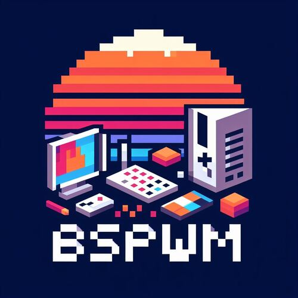
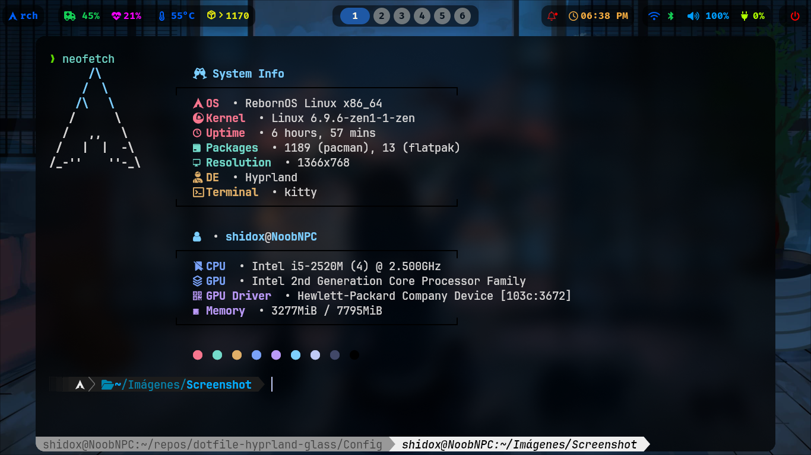
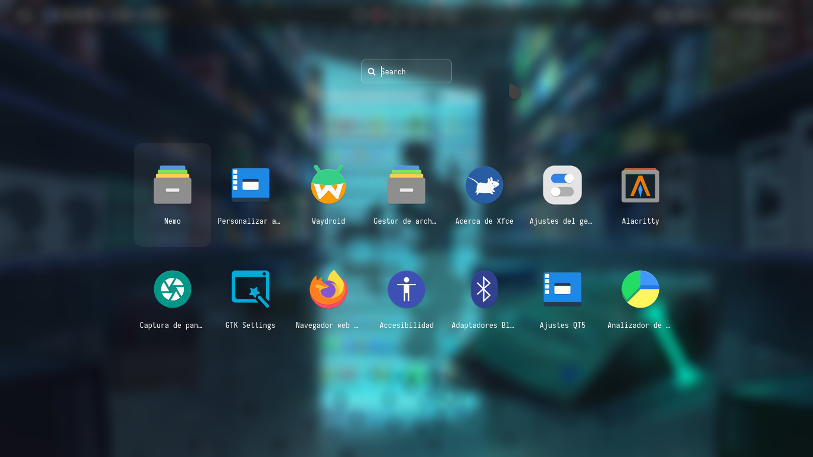

# DOTFILE BSPWM



## Scripts De Instalacion

Este es mi Dotfiles de hyprland, mi primer dotfiles, en este dot, trato de hacer que el consumo de recursos sea escaso, mi dotfiles tiene un tema glass.

## Instalacion

ESTA EN FASE DE BETA - no instalar aun

Algunas cosas no se respaldan, ASÍ QUE TEN CUIDADO.
Para ejecutar el scripts:

- cosas que se respaldan son: .zshrc

```bash
  curl https://raw.githubusercontent.com/Shidohs/dotfile-hyprland-glass/main/install_config.sh > install_config.sh
chmod +x install_config.sh

```

```bash
 ./install_config.sh

```

## Contenido

- WM : [Hyprland](https://github.com/baskerville/bspwm)
- Shell :[zsh](https://wiki.archlinux.org/index.php/zsh) con [oh my zsh](https://github.com/ohmyzsh/ohmyzsh) framework!
- Terminal :[kitty](https://github.com/kovidgoyal/kitty) y [alacritty](https://github.com/alacritty/alacritty)
- Panel : [polybar](https://github.com/polybar/polybar)
- Compositor :[picom](https://github.com/FT-Labs/picom)
- Notify : [dunst](https://wiki.archlinux.org/index.php/Dunst) 🔔
- Launcher :[rofi](https://github.com/davatorium/rofi)
- File Manager :[thunar](https://wiki.archlinux.org/index.php/Thunar)/[nemo](https://github.com/linuxmint/nemo)/[ranger](https://github.com/ranger/ranger) 📂
- Wallpaper Manager : [feh](https://feh.finalrewind.org/)

## Screenshots




## Acerca de

- AUTOR: [@Shidohs](https://github.com/Shidohs)
- Gracias a [adi1090x](https://github.com/adi1090x/rofi) por los temas de rofi
